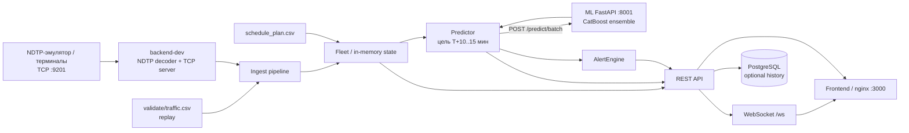
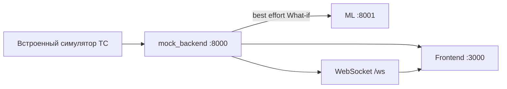

# Documentation: Moscow Transport Hackathon

## 1. Назначение документа

Этот документ описывает текущее состояние проекта **Moscow_transport_hakathon** и сопоставляет его с техническим заданием хакатона Московского транспорта **«Предиктор изменений в графике движения городского транспорта»**.

Документация подготовлена по состоянию ветки `main`, доступному на момент анализа 27.09.2026, и по приложенному ТЗ. При расхождении между ранними архитектурными документами, demo-инструкциями и текущим кодом приоритет здесь отдан текущему исходному коду, README компонентов, `docker-compose.yml`, а затем измерениям из `ml/PERFORMANCE.md` и `backend/README.md`.

В репозитории одновременно существуют **два backend-контура**:

- `mock_backend/` — стабильный демонстрационный backend с собственной симуляцией транспорта;
- `backend/` — production-oriented backend для NDTP-потока, сопоставления с расписанием, вызова ML, алертов и хранения истории.

Это принципиально: обычный `docker compose up` поднимает `mock_backend`, а реальный NDTP backend подключается через compose-профиль `dev`.

Репозиторий: <https://github.com/sheelestun/Moscow_transport_hakathon>

---

## 2. Назначение проекта

Система предназначена для **раннего прогнозирования нарушения графика наземного городского транспорта**.

Основная прогнозная задача:

> Для транспортного средства в момент `T` определить ожидаемое отклонение от расписания на первой целевой остановке, плановое время которой находится в окне **(T + 10 минут, T + 15 минут]**.

Система формирует не только численный прогноз, но и диспетчерский контекст:

- ожидаемая задержка в секундах;
- вероятность существенного опоздания;
- уровень риска;
- прогнозный интервал;
- предполагаемая причина;
- наиболее влияющие признаки;
- рекомендация диспетчеру;
- целевая остановка и участок маршрута.

Цель соответствует ТЗ: перейти от реакции на уже произошедшее нарушение к **упреждающему предупреждению за 10–15 минут**.

---

## 3. Требования ТЗ и компоненты проекта

ТЗ задаёт три основных компонента:

1. **ML-модуль**
   - прогноз задержки;
   - вероятность риска;
   - выявление паттернов перед сбоем;
   - соблюдение горизонта 10–15 минут.

2. **Backend**
   - приём потоковой NDTP-телеметрии;
   - сопоставление с расписанием;
   - расчёт производных признаков;
   - оркестрация ML;
   - REST/WebSocket API;
   - устойчивость к отказам источников.

3. **BI-дашборд**
   - карта;
   - положения ТС;
   - цветовая индикация риска;
   - карточки инцидентов;
   - обновление вслед за потоком.

Дополнительно ТЗ рекомендует Docker, Python 3.12+, CatBoost/PyTorch, OpenAPI/Swagger, Sphinx, механизмы деградации, масштабирование инференса, What-if и ONNX/TensorRT.

---

## 4. Фактическая архитектура

### 4.1. Реальный контур `backend/`



### 4.2. Демонстрационный контур `mock_backend/`



`mock_backend` сам генерирует движение ТС и предназначен прежде всего для стабильной демонстрации UI. Он не является NDTP-ingest backend.

### 4.3. Режимы Docker Compose

В `docker-compose.yml`:

- `backend` собирается из `./mock_backend`, порт `8000`;
- `backend-dev` собирается из `./backend`, включается профилем `dev`, HTTP публикуется на `8010`, NDTP на TCP `9201`;
- frontend по умолчанию смотрит на `8000`;
- для production backend frontend нужно переключить на `BACKEND_PORT=8010`.

То есть **обычный compose-запуск является demo-режимом**, а полный NDTP-контур требует `--profile dev`.

---

## 5. Поток данных production backend

### 5.1. Источники

Поддерживаются:

- NDTP TCP stream;
- replay исторического `traffic.csv`.

Оба источника преобразуются в нормализованный `Ping` с полями вроде:

`tr_id`, `unit_id`, `event_time`, `lat`, `lon`, `speed_kmh`, `heading_deg`, `location_valid`, `is_hist`, `source`, `received_at`.

### 5.2. Арбитраж NDTP и replay

Live NDTP имеет приоритет. Если от ТС недавно пришёл NDTP пакет, replay для него подавляется. Если live-поток молчит дольше `NDTP_FRESH_S` (по умолчанию 60 с), replay снова становится источником. После возврата NDTP live-поток снова получает приоритет.

### 5.3. DatasetClock

Датасет привязан к дню **2026-01-06**, поэтому backend использует `DatasetClock`, который отображает wall-clock время на временную шкалу датасета.

Для демо можно зафиксировать:

```bash
CLOCK_START=2026-01-06T08:00:00
CLOCK_SPEED=5
```

### 5.4. Schedule matching и state

Модуль state загружает плановое расписание, индексирует остановки и выделяет рейсы. Разрыв планового времени более 300 секунд трактуется как конечная/новый рейс.

По GPS восстанавливаются фактические прибытия. Backend считает:

- `cur_dev_s`;
- скорость сегмента;
- dwell;
- последнюю пройденную остановку;
- следующую остановку.

GPS-arrival logic использует:

- радиус остановки 60 м;
- последующее удаление 30 м;
- окно поиска от −7 до +12 минут относительно плана.

### 5.5. Выбор прогнозной точки

Каждые `PREDICT_TICK_S` backend выбирает для активного ТС первую плановую остановку в окне:

```text
(T + 10 min, T + 15 min]
```

Прогнозы пакетируются и отправляются в ML через `POST /predict/batch`.

### 5.6. Alert

Alert создаётся, если:

- горизонт корректен;
- `risk_score >= ALERT_RISK_THRESHOLD`;
- нет активного дубля для ТС.

Default threshold:

```text
ALERT_RISK_THRESHOLD=0.7
```

После фактического прибытия alert сверяется с GPS-фактом и может стать hit, false alarm или resolved.

---

## 6. Структура репозитория

```text
Moscow_transport_hakathon/
├── .github/workflows/             # CI
├── backend/                       # production-oriented backend
│   ├── app/
│   │   ├── main.py                # FastAPI + lifespan
│   │   ├── config.py              # env settings
│   │   ├── clock.py               # DatasetClock
│   │   ├── alerts.py              # alert engine
│   │   ├── api/                   # REST + WebSocket handlers
│   │   ├── ndtp/                  # NDTP codec/server
│   │   ├── ingest/                # NDTP/replay normalization
│   │   ├── state/                 # schedule, arrivals, fleet
│   │   ├── predict/               # ML client/predictor
│   │   └── db/                    # schema/history
│   ├── scripts/ndtp_loadtest.py
│   ├── tests/
│   ├── Dockerfile
│   └── requirements.txt
├── mock_backend/
│   ├── src/main.py
│   ├── src/simulator.py
│   ├── Dockerfile
│   └── requirements.txt
├── ml/
│   ├── src/
│   │   ├── features/tabular.py
│   │   ├── features/from_stream.py
│   │   ├── features/from_csv.py       # legacy
│   │   ├── models/torch_seq.py        # legacy
│   │   ├── train_catboost.py
│   │   ├── predict_submission.py
│   │   ├── inference_service.py
│   │   ├── replay_validate.py
│   │   ├── export_onnx.py
│   │   └── eval.py
│   ├── configs/catboost.json
│   ├── artifacts/
│   ├── Dockerfile
│   ├── requirements.txt
│   ├── requirements-inference.txt
│   ├── README.md
│   └── PERFORMANCE.md
├── frontend/
│   ├── index.html
│   ├── css/
│   ├── js/
│   │   ├── config.js
│   │   ├── api.js
│   │   ├── app.js
│   │   ├── map.js
│   │   ├── sidebar.js
│   │   ├── whatif.js
│   │   ├── mock.js
│   │   └── ...
│   ├── entrypoint.sh
│   ├── nginx.conf
│   └── Dockerfile
├── dataset/
├── docs/sphinx/
├── infra/
├── statistics/
├── ARCHITECTURE_AND_ROLES.md
├── LOCAL_SETUP.md
├── README.md
├── docker-compose.yml
└── pytest.ini
```

---

## 7. Production backend: назначение модулей

### `app/main.py`

Точка сборки сервиса. В lifespan запускаются clock, ingest, fleet, replay, ML client, predictor, alert engine, WebSocket hub, опциональная history-БД и NDTP server. При shutdown фоновые задачи и соединения корректно закрываются.

Backend запускается одним Uvicorn worker, потому что NDTP listener и оперативное состояние живут внутри процесса.

### `app/ndtp/`

Реализованы:

- framing;
- handshake;
- CRC-16/MODBUS;
- realtime frame;
- navigation cell decoding;
- asyncio TCP server.

NDTP порт: `9201/TCP`.

### `app/ingest/`

Отвечает за:

- загрузку `traffic.csv`;
- соответствие `unit_id -> tr_id`;
- нормализацию NDTP/replay;
- live/replay arbitration;
- фильтрацию неизвестных unit;
- обработку clock skew;
- доставку ping подписчикам.

### `app/state/`

Хранит буферы телеметрии и вычисляет online-state:

- position;
- current deviation;
- segment speed;
- dwell;
- arrivals;
- last/next stop.

### `app/predict/`

- `client.py` — HTTP client ML;
- `payload.py` — собирает `PredictRequest`;
- `predictor.py` — выбирает target 10–15 минут вперёд, вызывает batch inference, хранит последние прогнозы и fallback.

При недоступности ML:

```text
delay_pred_sec = cur_dev_s
```

### `app/alerts.py`

Преобразует красные прогнозы в алерты, дедуплицирует их и сверяет с фактическим прибытием.

### `app/db/`

PostgreSQL history:

- telemetry;
- arrivals;
- predictions;
- alerts.

Запись вынесена из live path; при падении Postgres backend продолжает работу и временно буферизует данные в памяти.

---

## 8. Backend API

### Production backend

| Метод | Endpoint | Назначение |
|---|---|---|
| GET | `/health` | состояние сервиса и зависимостей |
| GET | `/clock` | dataset clock |
| GET | `/routes` | линии/маршруты для dashboard |
| GET | `/vehicles` | текущее представление ТС |
| GET | `/vehicles/{vehicle_id}/schedule` | расписание ТС |
| GET | `/metrics/model` | ML + runtime metrics |
| GET | `/metrics/worst_stops` | проблемные остановки |
| GET | `/metrics/bunching` | bus bunching; сейчас обычно `[]` |
| GET | `/routes/{route_id}/signals` | traffic signals; сейчас `[]` |
| GET | `/routes/{route_id}/hours` | часы/рейсы |
| POST | `/whatif` | What-if |
| GET | `/alerts` | активные/закрытые alerts |
| GET | `/ingest/ndtp` | состояние NDTP listener |
| GET | `/ingest/vehicles` | latest ping/source |
| GET | `/state/vehicles` | derived state |
| GET | `/state/vehicles/{tr_id}/arrivals` | GPS arrivals |
| GET | `/predictions` | последние прогнозы |
| GET | `/predictions/recent` | недавние прогнозы |
| GET | `/history/summary` | сводка Postgres history |
| GET | `/history/alerts` | alerts из Postgres |
| WS | `/ws` | realtime events |

FastAPI также предоставляет `/docs` и `/openapi.json`.

WebSocket события:

```text
vehicle.update
alert.new
alert.verified
alert.resolved
whatif.result
```

### Mock backend

`mock_backend/src/main.py` реализует совместимый frontend contract: `/health`, `/routes`, `/vehicles`, `/vehicles/{id}/schedule`, `/alerts`, `/metrics/model`, `/metrics/worst_stops`, `/metrics/bunching`, `/whatif`, `/apply`, `/ws`.

Это симуляционный backend, не NDTP backend.

---

## 9. ML-модуль

### 9.1. Target и метрика

Target:

```text
target_delay_s
```

Знак важен: положительное значение означает опоздание, отрицательное — прибытие раньше плана.

Основная метрика:

```text
MAE = mean(abs(target_delay_s - prediction))
```

### 9.2. Anti-leak

Feature pipeline использует только:

- telemetry `event_time <= T`;
- плановое расписание;
- `cur_dev_s`.

`time_fact_begin` удаляется и не используется как вход модели.

### 9.3. Основная модель

Активный трек — CatBoost ensemble из 5 seed-моделей.

`ml/configs/catboost.json`:

```json
{
  "depth": 8,
  "iterations": 600,
  "learning_rate": 0.07,
  "loss_function": "RMSE",
  "l2_leaf_reg": 3.0,
  "n_seeds": 5
}
```

Основные артефакты:

```text
catboost_seed0.cbm ... catboost_seed4.cbm
catboost_meta.json
cache_features.pkl
```

Inference также поддерживает дополнительные артефакты для interval/class probabilities/uncertainty.

### 9.4. Вероятность и risk

Сервис может выдавать `p_early`, `p_ontime`, `p_late`.

Классы:

```text
early   < -60 s
ontime  -60..120 s
late    > 120 s
```

При наличии классификатора `risk_score = p_late`.

Пороги UI:

```text
green:  risk < 0.35
yellow: 0.35 <= risk < 0.70
red:    risk >= 0.70
```


### 9.5. Признаки

`ml/src/features/tabular.py` содержит 56 признаков.

**Текущее отклонение**

```text
cur_dev_s
```

**План и геометрия**

```text
lead_s
n_stops_between
plan_gap_prev_s
plan_gap_next_s
tgt_plan_gap_prev_s
plan_route_dist_m
plan_speed_kmh
```

**Manual fill**

```text
tgt_manual_fill
prev_manual_fill
mf_share_next
mf_share_trip
```

**Рейсы и конечные**

```text
n_trip_breaks
tgt_first_in_trip
tgt_idx_in_trip
tgt_left_in_trip
cur_idx_in_trip
break_gap_s
plan_gap_break_to_tgt_s
```

**GPS-история отклонений**

```text
gps_n
gps_last_dev
gps_med3
gps_med5
gps_max5
gps_min5
gps_slope
gps_age_s
gps_last_dwell_s
gps_dev_minus_cur
overdue_s
overdue_n
gps_n_trip
gps_trip_first_dev
```

**Движение**

```text
spd1
spd5
spd15
spd_std5
stop5
stop15
spd_trend
moving_spd15
disp5_m
disp15_m
n_pkt15
last_fix_age_s
last_speed
```

**Положение и ETA**

```text
dist_tgt_m
dist_next_stop_m
route_left_m
eta_dev_s
eta_dev_moving_s
req_speed_kmh
```

**Время**

```text
hour
hour_sin
hour_cos
```

**Категориальный признак**

```text
route
```

### 9.6. Объяснение прогноза

Inference формирует:

- `reason_pattern`;
- `causes`;
- `top_features`;
- `recommendation`;
- `recommendation_text`.

В ML-коде/документации присутствуют паттерны:

```text
accumulated_delay
long_dwell
speed_drop
traffic_jam_ahead
terminal_turnaround
ahead_of_schedule
on_track
```

`top_features` используется для объяснения вклада признаков в прогноз.

### 9.7. Confidence и data status

Прогноз содержит:

```text
delay_interval_sec = [low, high]
```

Confidence зависит от ширины интервала и уменьшается при плохом качестве телеметрии.

Поддерживаются состояния:

```text
live
stale
no_telemetry
off_route
fallback
```

---

## 10. ML API

Базовый адрес в Docker:

```text
http://ml:8001
```

С хоста:

```text
http://localhost:8001
```

| Метод | Endpoint | Назначение |
|---|---|---|
| GET | `/health` | состояние модели |
| POST | `/predict` | одиночный прогноз |
| POST | `/predict/batch` | пакет прогнозов |
| POST | `/whatif/predict` | What-if |
| GET | `/metrics/model` | качество и latency |
| GET | `/model/info` | признаки, параметры, версия |
| POST | `/reload` | перечитать артефакты |
| GET | `/docs` | Swagger |

### 10.1. Вход `/predict`

Основные поля:

```json
{
  "sample_id": "string",
  "tr_id": 123,
  "T": "2026-01-06T08:00:00",
  "target_stop_id": 456,
  "target_time_begin": "2026-01-06T08:12:00",
  "cur_dev_s": 95.0,
  "telemetry": [],
  "schedule": []
}
```

Telemetry использует поля вроде:

```text
tr_id
event_time
lon
lat
speed
location_valid
is_hist_data
```

Schedule использует, в частности:

```text
tr_id
tt_action_item_id
time_begin
geom
manual_fill
building_address
```

Если `schedule` не передан, сервис может использовать `SCHEDULE_PATH`.

### 10.2. Выход `/predict`

Ключевые поля:

```text
sample_id
delay_pred_sec
delay_interval_sec
p_early
p_ontime
p_late
risk_score
risk_level
confidence
lead_min
horizon_ok
reason_pattern
recommendation
recommendation_text
causes
top_features
data_status
model_version
latency_ms
```

---

## 11. What-if

Поддерживаются сценарии:

```text
add_reserve
adjust_interval
detour
signal_priority
hold_at_stop
```

Production backend `POST /whatif` использует контекст последнего прогноза и вызывает `POST /whatif/predict` ML-сервиса.

Текущий ML What-if не является полноценной транспортной симуляцией. В inference-коде используются фиксированные эвристические поправки:

| Сценарий | Изменение задержки |
|---|---:|
| `add_reserve` | −60 с |
| `adjust_interval` | −30 с |
| `detour` | −90 с |
| `signal_priority` | −45 с |
| `hold_at_stop` | +30 с |

После этого пересчитывается risk.

Следовательно, What-if реализован как **демонстрационная эвристическая оценка**, а не как причинная модель городской транспортной системы.

В `mock_backend` также есть heuristic fallback, а `apply=true` способен изменить дальнейшую симуляцию.

---

## 12. BI/frontend

Frontend является статическим SPA без обязательной JS-сборки.

Технологии:

- HTML/CSS/vanilla JavaScript;
- MapLibre GL;
- nginx.

Docker image основан на `nginx:1.27-alpine`.

### 12.1. Элементы интерфейса

На dashboard реализованы:

- число ТС на линии;
- число красных/жёлтых/зелёных ТС;
- статус подключения;
- информация о модели;
- шкала «Ближайшие 15 минут»;
- карта;
- фильтр линий;
- risk overlay;
- список ТС, требующих внимания;
- список сверенных прогнозов;
- маршруты;
- опоздания по часам;
- проблемные остановки;
- bus bunching widget;
- карточка ТС;
- расписание;
- What-if drawer.

### 12.2. Источник данных

`frontend/js/config.js` поддерживает:

```text
MODE=mock
MODE=live
```

Mock mode получает данные прямо из browser mock.

Live mode использует REST + WebSocket.

Runtime-конфигурация:

```text
MODE
API_BASE
WS_URL
```

Её также можно переопределять query-параметрами.

### 12.3. Offline/degraded UX

При разрыве WebSocket:

- UI сохраняет последнее известное состояние;
- показывает потерю связи;
- переводит статус в `degraded`;
- переподключается с exponential backoff до 15 секунд.

---

## 13. Ограничение route model в production backend

Используемый production dataset не содержит полноценного общего route identifier для городской маршрутной сети.

Текущая реализация поэтому фактически трактует scheduled vehicle как собственный `route_id`, а направления получает из формы рейсов.

Геометрия по умолчанию строится прямыми между остановками. Код допускает опциональный файл:

```text
backend/app/api/route_shapes.json
```

для заранее подготовленных street polylines.

Следствия:

- карта работает;
- положение ТС и последовательность остановок отображаются;
- это не полноценная модель всей реальной маршрутной сети Москвы;
- `GET /metrics/bunching` production backend возвращает пустой список, поскольку нет корректного отношения нескольких ТС к одной route/direction;
- `GET /routes/{id}/signals` также возвращает `[]`, поскольку traffic-light данных в dataset нет.

---

## 14. Форматы данных

Датасет организаторов не хранится в Git полностью и скачивается отдельно.

Ожидаемая структура:

```text
dataset/
├── docs/
├── labels/
│   ├── labels_train.csv
│   ├── labels_test.csv
│   └── ...
├── train/
│   ├── traffic.csv
│   └── schedule.csv
├── test/
│   ├── traffic.csv
│   └── schedule.csv
├── validate/
│   ├── traffic.csv
│   ├── schedule_plan.csv
│   └── points.csv
├── sample_submission.csv
├── ndtp-telemetry-emulator.tar
└── README.md
```

### 14.1. Телеметрия

Поля, описанные и используемые проектом:

```text
packet_id
tr_id
unit_id
event_time
device_event_id
location_valid
gps_time
lon
lat
alt
speed
heading
receive_time
is_hist_data
```

### 14.2. Прогнозные точки

В train/test labels и validate points используются, в частности:

```text
sample_id
tr_id
T
target_stop_id
target_time_begin
cur_dev_s
target_delay_s
target_class
```

`target_delay_s`/`target_class` доступны только там, где имеется разметка.

### 14.3. Расписание

Ключевые поля feature/backend-кода:

```text
tr_id
tt_action_item_id
time_begin
geom
manual_fill
building_address
```

Фактический `time_fact_begin` не используется ML как вход.

---

## 15. Submission и обучение

Оценка:

```bash
python ml/src/train_catboost.py --dataset ./dataset --eval
```

Финальное обучение и submission:

```bash
python ml/src/train_catboost.py \
  --dataset ./dataset \
  --fit \
  --out submission.csv
```

Проверка online inference:

```bash
python ml/src/replay_validate.py \
  --dataset ./dataset \
  --submission submission.csv \
  --url http://localhost:8001 \
  --send-schedule
```

---

## 16. Docker и запуск

### 16.1. Требования

По `LOCAL_SETUP.md`:

- Docker;
- Docker Compose v2;
- Python 3.12+ для dev/test;
- примерно 4 ГБ RAM;
- примерно 2 ГБ диска;
- dataset организаторов.

Эмулятор перед первым запуском:

```bash
docker load -i dataset/ndtp-telemetry-emulator.tar
```

### 16.2. Стабильный demo-режим

```bash
docker compose up -d --build
```

Основные компоненты:

- ML;
- `mock_backend` на `8000`;
- frontend на `3000`.

### 16.3. Mock + production backend

```bash
docker compose --profile dev up -d --build
```

Порты:

| Сервис | Порт |
|---|---:|
| frontend | 3000 |
| mock backend | 8000 |
| production backend HTTP | 8010 |
| production backend NDTP | 9201/TCP |
| ML | 8001 |
| NDTP emulator control | 18080 |
| PostgreSQL | 5432 |
| Redis | 6379 только внутри compose |

### 16.4. Frontend на production backend

```bash
BACKEND_PORT=8010 docker compose --profile dev up -d
```

Runtime frontend:

```text
API_BASE=http://localhost:8010
WS_URL=ws://localhost:8010/ws
```

### 16.5. Production backend с зависимостями

```bash
docker compose --profile dev up -d --build \
  ml redis postgres backend-dev
```

### 16.6. Swagger/UI

```text
Frontend:           http://localhost:3000
Mock backend:       http://localhost:8000/docs
Production backend: http://localhost:8010/docs
ML:                 http://localhost:8001/docs
Emulator control:   http://localhost:18080
```

---

## 17. Конфигурация production backend

Основные env-переменные:

| Переменная | Default | Назначение |
|---|---|---|
| `LOG_LEVEL` | `INFO` | логирование |
| `CORS_ORIGINS` | `["*"]` | CORS |
| `NDTP_ENABLED` | `true` | NDTP listener |
| `NDTP_HOST` | `0.0.0.0` | bind |
| `NDTP_PORT` | `9201` | TCP port |
| `NDTP_IDLE_TIMEOUT_S` | `300` | idle timeout |
| `NDTP_MAX_CONNECTIONS` | `20000` | connections |
| `NDTP_BACKLOG` | `4096` | socket backlog |
| `DATASET_DIR` | optional | dataset path |
| `DATASET_SPLIT` | `validate` | split |
| `CLOCK_DAY` | `2026-01-06` | dataset day |
| `CLOCK_START` | empty | fixed start |
| `CLOCK_SPEED` | `1.0` | time scale |
| `INGEST_QUEUE_SIZE` | `100000` | ingest queue |
| `REPLAY_ENABLED` | `true` | replay |
| `REPLAY_BACKFILL_S` | `3600` | startup backfill |
| `NDTP_FRESH_S` | `60` | live freshness |
| `NDTP_MAX_CLOCK_SKEW_S` | `300` | clock skew |
| `STATE_TICK_S` | `2` | state tick |
| `ML_URL` | `http://ml:8001` | ML address |
| `ML_TIMEOUT_S` | `10` | ML timeout |
| `PREDICT_TICK_S` | `5` | predictor tick |
| `PREDICT_RETRY_S` | `30` | ML retry |
| `PREDICT_MAX_PING_AGE_S` | `900` | telemetry age |
| `ALERT_RISK_THRESHOLD` | `0.7` | alert threshold |
| `ALERT_TICK_S` | `5` | alert tick |
| `WS_TICK_S` | `1` | WS tick |
| `UI_MAX_PING_AGE_S` | `1800` | UI stale cutoff |
| `DATABASE_URL` | optional | PostgreSQL |
| `HISTORY_FLUSH_S` | `1` | history flush |

### ML env

| Переменная | Назначение |
|---|---|
| `ML_ARTIFACTS` | каталог моделей |
| `SCHEDULE_PATH` | fallback schedule |
| `ML_MODEL_VERSION` | версия модели |
| `ML_RISK_MID_SEC` | fallback sigmoid |
| `ML_RISK_SLOPE_SEC` | fallback sigmoid |
| `ML_STATS_DIR` | каталог metrics/tables |

---

## 18. Зависимости

### Production backend

```text
fastapi==0.115.0
uvicorn[standard]==0.30.6
httpx==0.27.2
pydantic==2.9.2
pydantic-settings==2.5.2
numpy==2.5.3
asyncpg==0.30.0
```

### ML training/dev

Основные библиотеки:

```text
numpy
pandas
scikit-learn
catboost
torch
onnx
onnxruntime
fastapi
uvicorn
pydantic
shapely
pyproj
```

PyTorch присутствует в полном ML requirements, но не является основным текущим inference path.

### ML inference Docker

Облегчённый runtime использует отдельный `requirements-inference.txt`:

```text
numpy
pandas
scipy
six
fastapi
uvicorn
pydantic
catboost
```

Docker inference сознательно не включает PyTorch и ONNX.

---

## 19. PostgreSQL

Postgres используется production backend при заданном `DATABASE_URL`.

Сохраняются:

- telemetry;
- detected arrivals;
- predictions;
- alerts.

History writer работает асинхронно относительно live path. При недоступности PostgreSQL backend продолжает работу, буферизует данные в памяти, сообщает `degraded` и пытается записать накопленное после reconnect.

API:

```text
GET /history/summary
GET /history/alerts
```

---

## 20. Redis

`docker-compose.yml` содержит Redis 7 Alpine и описывает его как realtime event bus / feature store.

Однако при анализе текущего `backend/app/` **активное использование Redis в runtime-коде не подтверждено**.

Фактический realtime state хранится in-memory, WebSocket находится в backend, persistent history идёт в PostgreSQL.

Redis следует считать инфраструктурно подготовленным сервисом / частью раннего архитектурного плана, но не обязательным звеном текущего подтверждённого runtime pipeline.


## 21. Обработка ошибок и деградация

### 21.1. ML недоступен

Production backend:

- не падает;
- использует baseline `delay_pred_sec = cur_dev_s`;
- помечает прогноз как fallback;
- продолжает REST/WS;
- повторяет подключение через `PREDICT_RETRY_S`.

### 21.2. NDTP недоступен

Для транспортного средства может продолжать использоваться historical replay. При восстановлении live NDTP он снова получает приоритет.

### 21.3. Нет телеметрии в ML

Если прогноз возможно сформировать по оставшемуся контексту, inference-service отвечает HTTP 200 с:

```text
data_status = no_telemetry
```

и снижает confidence.

### 21.4. Устаревшие координаты

При отсутствии свежих координат статус становится `stale`, confidence снижается.

### 21.5. Off-route

Если ТС примерно более чем на 3 км удалено от своих остановок:

```text
data_status = off_route
```

confidence уменьшается.

### 21.6. Ошибка модели/feature pipeline

Inference-service стремится вернуть baseline вместо HTTP 500:

```text
data_status = fallback
delay_pred_sec = cur_dev_s
```

### 21.7. Ошибка одного элемента batch

Неисправный элемент batch не должен обрушать остальные прогнозы.

### 21.8. Нет расписания

ML возвращает HTTP 422 с диагностикой, поскольку прогнозировать целевую остановку невозможно.

### 21.9. PostgreSQL недоступен

Backend продолжает live-работу, буферизует history в памяти и сообщает `degraded`.

### 21.10. Frontend offline

Frontend сохраняет последнее известное состояние и автоматически переподключается.

---

## 22. Метрики и производительность

Цифры ниже взяты из измерений, зафиксированных в репозитории. Они **не были повторно независимо прогнаны при составлении этого документа**.

### 22.1. Качество ML

По `ml/PERFORMANCE.md`, измерения 26.09.2026:

| Схема | CatBoost | Baseline `cur_dev_s` |
|---|---:|---:|
| holdout train → test | 39.8 с MAE | 93.4 с |
| proxy, блоки по 30 мин | 38.8 с | 88.4 с |
| LOVO | 78.9 с | 88.4 с |

Также репозиторий сообщает:

- coverage прогнозного интервала около 80%;
- AUC `p_late` около 0.97.

### 22.2. ML latency

Docker:

| Режим | Результат |
|---|---|
| `/predict` через HTTP | p50 44 мс, p95 55 мс |
| внутреннее время сервиса | p50 около 19 мс |
| `/predict/batch`, 151 точка | около 3.0 с total, 20 мс/точка |

Local Uvicorn:

| Режим | Результат |
|---|---|
| `/predict` HTTP | p50 54 мс, p95 65 мс |
| `/predict/batch`, 151 точка | около 1.6 с |

### 22.3. ML container

Зафиксировано:

- image около 1.03 ГБ;
- build около 1–2 минут;
- cold start до готового `/health` около 2.2 с;
- память под нагрузкой около 130 МБ.

### 22.4. NDTP backend load test

`backend/README.md` приводит измерения:

| Load | Delivered | Latency | CPU |
|---|---:|---|---:|
| 8 000 units / 1 s, распределённая отправка | 120 000 / 120 000 | p50 0.3 мс, p99 1.2 мс | 44% |
| 16 000 units / 1 s, burst | 240 000 / 240 000 | p99 около 0.6 с | 51% |
| 16 000 units / 0.5 s, burst | 320 000 / 320 000 | p99 около 1.3 с, saturation | 99% |

В документе backend также указана оценка ceiling порядка 25–30 тыс. packets/s на core и peak memory около 149 МБ для 16 000 connections.

### 22.5. Online parity

`ml/PERFORMANCE.md` сообщает совпадение online и batch prediction на 151/151 validate points с максимальной разницей 0.00 с в эталонном ML replay.

При этом `backend/README.md` отдельно фиксирует важное ограничение end-to-end: `cur_dev_s`, восстановленный честно online из GPS, может отличаться от предоставленного организаторами `cur_dev_s`. Поэтому end-to-end прогноз backend может расходиться с submission даже при той же ML-модели.

---

## 23. ONNX и оптимизация

В репозитории присутствует:

```text
ml/src/export_onnx.py
```

Зафиксированные в `ml/README.md` результаты:

| Формат | Latency | Комментарий |
|---|---:|---|
| CatBoost native full | ~9.38 мс | использует `route` |
| ONNX FP32 noroute | ~1.57 мс | примерно 6× быстрее |
| ONNX INT8 | не получен | стандартный quantizer не поддержал `ai.catboost` domain |

Важно:

**ONNX не является основным serving path `ml/src/inference_service.py`.**

Inference Docker специально собирается без ONNX/PyTorch. ONNX является экспериментальным/оптимизационным контуром.

ONNX-вариант не использует категориальный `route`, из-за чего имеет худшее качество, чем full CatBoost.

TensorRT inference в текущем проверенном коде не подтверждён.

---

## 24. Sphinx и OpenAPI

### OpenAPI

FastAPI автоматически генерирует Swagger/OpenAPI для production backend, mock backend и ML.

### Sphinx

В `docs/sphinx/` присутствует Sphinx-конфигурация с:

- `sphinx.ext.autodoc`;
- `sphinx.ext.napoleon`;
- `sphinx.ext.viewcode`;
- `sphinx.ext.autosummary`;
- RTD theme;
- разделами overview, ML, inference API, backend и modules.

Пути `ml/src` и `backend` добавлены в autodoc.

Сборка:

```bash
cd docs/sphinx
make html
```

Наличие конфигурации подтверждено. Актуальная успешная HTML-сборка в рамках этого анализа не запускалась.

---

## 25. Тестирование

Документированный локальный запуск тестов:

```bash
python -m venv .venv
source .venv/bin/activate

pip install \
  -r backend/requirements.txt \
  -r mock_backend/requirements.txt \
  -r ml/requirements.txt \
  pytest httpx pydantic-settings asyncpg

pytest
```

В `LOCAL_SETUP.md` перечислены:

```text
backend/tests
mock_backend/tests
ml/tests
statistics/tests
```

Postgres-тест выполняется при наличии `TEST_DATABASE_URL`.

Для NDTP есть отдельный нагрузочный тест:

```bash
python backend/scripts/ndtp_loadtest.py --help
```

---

## 26. Сценарий демонстрации

Из-за двух backend-контуров полезно разделять стабильный UI-demo и полный NDTP-demo.

### 26.1. Стабильный UI-demo

```bash
docker load -i dataset/ndtp-telemetry-emulator.tar
docker compose up -d --build
docker compose ps
```

Открыть:

```text
http://localhost:3000
```

Показать:

1. карту;
2. цветовые уровни риска;
3. карточку ТС;
4. `delay_pred_sec`;
5. `reason_pattern`;
6. `top_features`;
7. alerts;
8. расписание;
9. What-if;
10. model metrics;
11. UI при потере backend.

Этот сценарий использует `mock_backend`.

### 26.2. Полный NDTP/backend demo

Пример:

```bash
CLOCK_START=2026-01-06T08:00:00 \
BACKEND_PORT=8010 \
docker compose --profile dev up -d --build
```

Проверить:

```bash
curl http://localhost:8010/health
```

В health должны быть состояния NDTP, replay, predictor, alerts, history и ML.

Настроить эмулятор:

```bash
curl -X POST http://localhost:18080/api/config \
  -H "Content-Type: application/json" \
  -d '{"targetHost":"backend-dev","targetPort":9201,"autoGenerate":true}'
```

Для реальных validate-треков:

```bash
python infra/emulator_replay.py \
  --dataset ./dataset \
  --emu-url http://localhost:18080 \
  --target-host backend-dev \
  --target-port 9201 \
  --clock-url http://localhost:8010
```

На демонстрации production-контура имеет смысл показать:

1. `GET /ingest/ndtp`;
2. `GET /ingest/vehicles`;
3. `GET /state/vehicles`;
4. `GET /predictions`;
5. `GET /alerts`;
6. `GET /metrics/model`;
7. frontend, направленный на `:8010`;
8. остановку ML и fallback;
9. остановку Postgres и degraded/history buffer;
10. потерю NDTP и возврат к replay.

---

## 27. Известные ограничения

### 27.1. Два backend и неоднозначный default

Команда:

```bash
docker compose up
```

не делает production NDTP backend главным backend для frontend. По умолчанию используется `mock_backend`.

Для полного контура нужен `--profile dev` и переключение frontend на порт `8010`.

### 27.2. Устаревшие фрагменты demo-документации

`infra/DEMO.md` содержит описание старого состояния, где NDTP parser ещё считался незавершённым.

Текущий `backend/README.md` и код `backend/app/` уже содержат NDTP codec/server, ingest, state, predictor, alerts и history.

Поэтому `infra/DEMO.md` нельзя считать единственным source of truth.

### 27.3. Известная проблема frontend live mode

В текущем `backend/README.md` зафиксирован bug: `frontend/js/app.js` использует `source.getSignals(...)` как синхронный результат, тогда как `frontend/js/api.js` определяет `getSignals` как `async`.

В live mode это может приводить к `TypeError` во время обновления UI. Production endpoint signals всё равно возвращает `[]`.

### 27.4. Route semantics

Dataset не содержит полноценной общей route network. Production backend вынужден использовать vehicle-centric representation.

### 27.5. Traffic-light data

Реальная интеграция со светофорными фазами не найдена. Светофоры в mock/frontend demo являются симуляционными.

### 27.6. Door status

ТЗ требует учитывать status дверей. В проверенной normalized telemetry production backend и активных ML features отдельная обработка door status не обнаружена.

### 27.7. Redis

Контейнер есть в compose, но активное использование Redis production backend не подтверждено.

### 27.8. Горизонтальное масштабирование

Production backend сознательно однопроцессный из-за in-memory state и NDTP listener. Горизонтальный scaling потребует выноса состояния и координации наружу.

### 27.9. What-if

What-if эвристический, а не полноценный причинный/имитационный прогноз.

### 27.10. PyTorch/Transformer ensemble

PyTorch sequence path оставлен как legacy. Основной serving использует CatBoost.

### 27.11. TensorRT и INT8

TensorRT pipeline не найден. Рабочая INT8 quantization не получена.

---

## 28. Матрица соответствия ТЗ

Обозначения:

- ✅ реализовано и подтверждено кодом;
- 🟡 частично / с ограничениями;
- ⚪ не найдено в активном коде или не подтверждено.

| Требование ТЗ | Статус | Реализация / замечание |
|---|---|---|
| Прогноз за 10–15 минут | ✅ | target в `(T+10, T+15]` |
| Нет прогнозов задним числом | ✅ | выбирается только будущая остановка |
| Независимый Backend и ML | ✅ | отдельные FastAPI-сервисы |
| BI/dashboard | ✅ | отдельный frontend/nginx |
| Docker | ✅ | Dockerfiles + compose |
| NDTP TCP ingest | ✅ | `backend/app/ndtp` |
| NDTP parser/CRC/handshake | ✅ | protocol/server |
| Historical replay | ✅ | ingest replay |
| Приоритет live NDTP | ✅ | arbitration |
| Schedule matching | ✅ | state/schedule/fleet |
| Текущее отклонение | ✅ | `cur_dev_s` |
| Скорость на сегменте | ✅ | production state |
| Dwell | ✅ | arrival/state logic |
| Door status | ⚪ | отдельная обработка не найдена |
| ML delay prediction | ✅ | CatBoost ensemble |
| Вероятность задержки | ✅ | `p_late` / `risk_score` |
| MAE | ✅ | offline + live verified error |
| Паттерн причины | ✅ | `reason_pattern`, feature contributions |
| Recommendation | ✅ | ML/backend alert |
| Карта | ✅ | MapLibre |
| Положения ТС | ✅ | REST + WS |
| Green/yellow/red | ✅ | 0.35 / 0.70 |
| Incident card | ✅ | frontend |
| Realtime updates | ✅ | WebSocket |
| OpenAPI/Swagger | ✅ | FastAPI |
| Sphinx | ✅ | `docs/sphinx` |
| Низкая ML latency | ✅ | измерения значительно ниже 1–2 с |
| NDTP throughput | ✅ | отдельный load-test |
| Деградация при отказе ML | ✅ | baseline fallback |
| Деградация при отказе NDTP | ✅ | replay takeover |
| Деградация при отказе Postgres | ✅ | buffer/reconnect |
| Hot reload модели | ✅ | `POST /reload` |
| What-if | 🟡 | есть, но эвристический |
| Advanced road Map Matching | 🟡 | stop matching есть; road matching нет |
| ONNX | 🟡 | export/benchmark, не основной serving |
| INT8 | ⚪ | рабочий результат не получен |
| TensorRT | ⚪ | не найден |
| CatBoost + PyTorch/Transformer | ⚪ | PyTorch legacy |
| GPU | ⚪ | активный inference CPU-oriented |
| Полная городская route network | 🟡 | ограничена dataset |
| Реальные traffic lights | ⚪ | production endpoint пустой |
| Redis feature store/event bus | 🟡 | контейнер есть, использование не подтверждено |

---

## 29. Что фактически реализовано

Подтверждены:

- CatBoost ML pipeline;
- единая offline/online feature-функция;
- anti-leak;
- ensemble;
- probability/risk output;
- uncertainty interval;
- explanation/top features;
- recommendations;
- FastAPI ML inference;
- batch inference;
- model reload;
- What-if endpoint;
- NDTP wire codec;
- NDTP asyncio server;
- unit → vehicle mapping;
- historical replay;
- NDTP/replay failover;
- DatasetClock;
- GPS arrival detection;
- current deviation;
- segment speed;
- dwell;
- target selection 10–15 минут;
- ML orchestration;
- fallback при отказе ML;
- alerts;
- alert verification;
- REST API;
- WebSocket;
- Postgres history;
- buffering при отказе Postgres;
- MapLibre dashboard;
- mock/live frontend modes;
- Docker;
- OpenAPI;
- Sphinx configuration;
- tests;
- NDTP load-test;
- ML performance benchmark;
- ONNX export experiment.

---

## 30. Что заявлено ТЗ, но не найдено в коде или реализовано неполностью

### Не найдено как полноценная активная реализация

1. **Door status**
   - Требуется ТЗ.
   - Отдельный production feature/pipeline не обнаружен.

2. **Полноценный road-network Map Matching**
   - GPS stop matching есть.
   - Online matching к дорожному графу не подтверждён.

3. **TensorRT**
   - Не найден.

4. **Рабочая INT8 quantization**
   - Попытка есть, рабочий результат не получен.

5. **Активный CatBoost + PyTorch/Transformer ensemble**
   - PyTorch sequence code legacy.
   - Serving CatBoost.

6. **Реальные светофорные фазы**
   - Production API возвращает `[]`.

7. **Подтверждённый Redis feature store/event bus**
   - Redis service есть.
   - Runtime usage не подтверждён.

### Частично

1. **Map Matching**
   - stop matching реализован;
   - road matching нет.

2. **What-if**
   - API/UI есть;
   - эффект эвристический.

3. **Маршрутная сеть**
   - визуализация есть;
   - dataset ограничивает модель реальных routes.

4. **Масштабируемость backend**
   - ingest throughput протестирован;
   - stateful backend остаётся one-worker.

5. **ONNX optimization**
   - export/benchmark есть;
   - основной сервис CatBoost native.

---

## 31. Соответствие критериям хакатона

### Критерий 1. Точность ML

Репозиторий содержит submission pipeline, несколько validation schemes, MAE и online/batch tests.

Официальный score следует брать с платформы хакатона. Локальные значения репозитория не заменяют официальный результат.

### Критерий 2. Горизонт 10–15 минут

Production predictor явно выбирает target в:

```text
(T + 10 min, T + 15 min]
```

Health содержит runtime-показатели соблюдения горизонта.

### Критерий 3. Три модуля + Docker

Физически разделены:

```text
frontend
backend
ml
```

Для доказательства NDTP ingest нужно использовать именно `backend-dev`, а не default `mock_backend`.

### Критерий 4. BI dashboard

Основные элементы ТЗ реализованы. Перед финальным live-demo следует устранить отмеченную проблему `getSignals`.

### Критерий 5. Производительность и надёжность

Есть:

- ML latency benchmark;
- cold start;
- memory measurement;
- degradation scenarios;
- NDTP load-test;
- ML fallback;
- NDTP→replay failover;
- Postgres reconnect.

---

## 32. Source of truth внутри репозитория

Для дальнейшей разработки рекомендуется ориентироваться так:

**Запуск**

```text
LOCAL_SETUP.md
docker-compose.yml
```

**Production backend**

```text
backend/README.md
backend/app/
```

**ML**

```text
ml/README.md
ml/PERFORMANCE.md
ml/src/
```

**Frontend contract**

```text
frontend/js/api.js
frontend/js/mock.js
frontend/js/app.js
```

**Исходные контракты и архитектурные решения**

```text
ARCHITECTURE_AND_ROLES.md
```

**Demo**

```text
infra/DEMO.md
```

При этом `infra/DEMO.md` содержит устаревшие фрагменты про отсутствие NDTP parser и должен читаться вместе с текущим `backend/README.md`.

---

## 33. Итог

Проект содержит два уровня зрелости.

### Демонстрационный уровень

- стабильный mock backend;
- готовый dispatcher UI;
- What-if;
- model metrics;
- удобный сценарий показа.

### Production-oriented уровень

- настоящий NDTP parser/server;
- replay/live arbitration;
- online state;
- GPS schedule matching;
- predictor строго на горизонте 10–15 минут;
- CatBoost inference;
- alert engine;
- PostgreSQL history;
- degraded modes;
- load/performance tests.

Самая важная эксплуатационная особенность: **default Docker Compose по-прежнему использует mock backend**. Для демонстрации полного соответствия ТЗ необходимо запускать `backend-dev` и направлять frontend на порт `8010`.

Наиболее заметные неполные пункты относительно максимального образа решения из ТЗ:

- door status;
- полноценный road map matching;
- реальная traffic-light integration;
- активный Redis feature store/event bus;
- TensorRT/INT8;
- активный CatBoost + Transformer/PyTorch ensemble;
- причинно обоснованный What-if;
- полноценная общая городская маршрутная сеть.

При этом основное ядро задания, то есть **ранний прогноз на 10–15 минут, независимые Backend/ML, потоковый контур, алерты, BI-интерфейс, Docker, OpenAPI, деградация и измеренная производительность**, в репозитории в значительной степени реализовано.

---

## 34. Использованные материалы

При составлении документа проверялись:

- корневой `README.md`;
- `docker-compose.yml`;
- `LOCAL_SETUP.md`;
- `ARCHITECTURE_AND_ROLES.md`;
- `backend/README.md`;
- исходники `backend/app/`;
- `mock_backend/src/main.py`;
- `ml/README.md`;
- `ml/PERFORMANCE.md`;
- `ml/src/features/tabular.py`;
- `ml/src/inference_service.py`;
- `ml/configs/catboost.json`;
- frontend `index.html`, `js/config.js`, `js/api.js`, `js/app.js`;
- `docs/sphinx/conf.py` и `index.rst`;
- `infra/DEMO.md`;
- приложенное ТЗ «Предиктор изменений в графике движения городского транспорта.pdf».

Заявленные benchmark-значения в этом документе приведены как результаты, зафиксированные авторами репозитория. Они не выдаются за независимо повторённые измерения.
